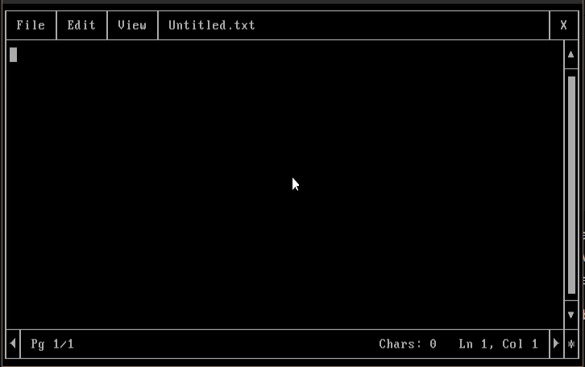
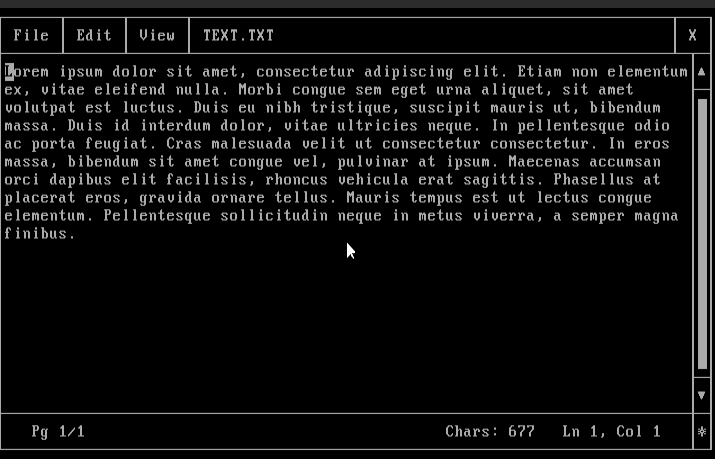
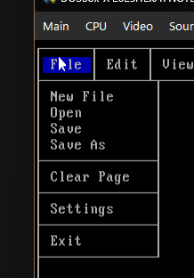
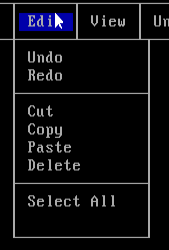
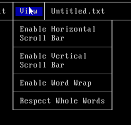
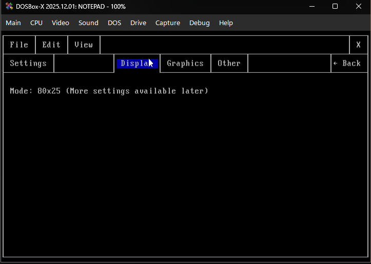
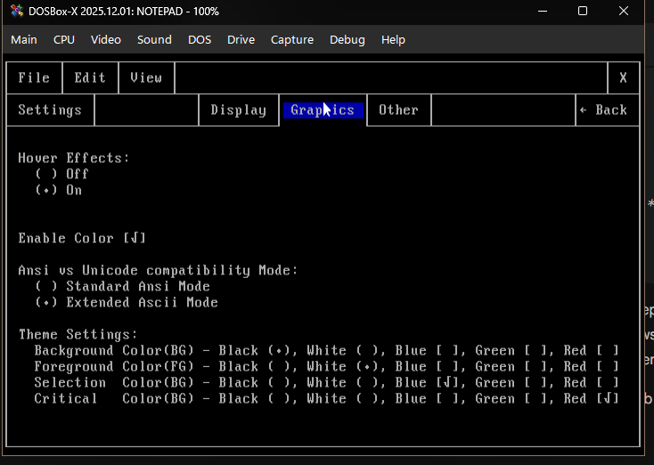
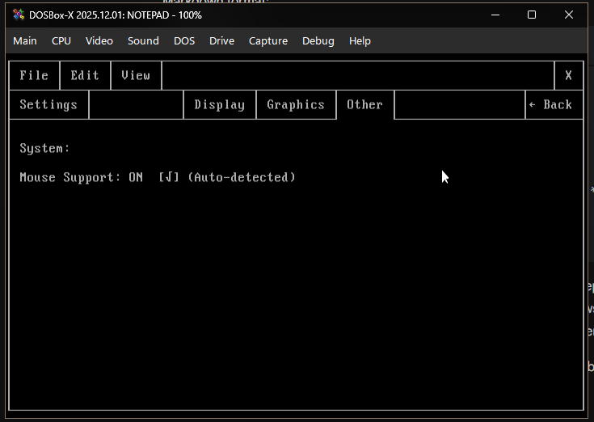
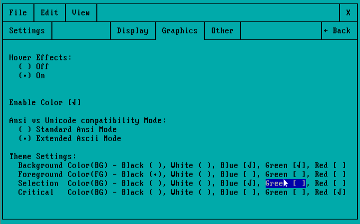
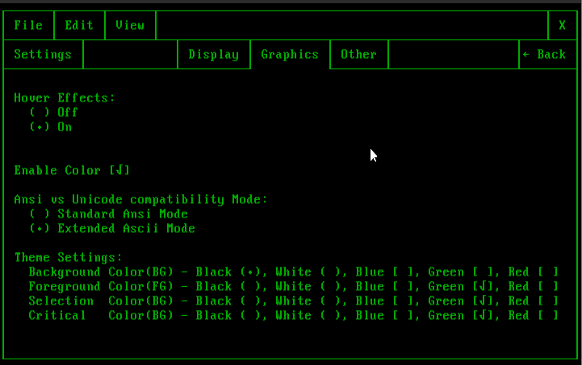

# Terminal-Notepad-Dos
Terminal-Notepad-DOS is a text editor inspired by Windows' Notepad, built entirely from scratch in C++ with the help of Google Gemini for classic MS-DOS environments. It brings a modern, Windows-like GUI experience into a pure 80x25 text-mode terminal. Yes, I know that the whole program is made with the help of AI. Because I'm not good at coding at this level, I only know how to design the user interface, and I love a DOS and retro-futuristic aesthetic.

Designed mainly for mouse-based usage, but keyboard navigation is completely supported.

Main Screen, running under DOSBox

Preview with demo text

Menus preview

  

# Features of the application:

Core Engine & Architecture:

 - Direct VRAM Rendering: Bypasses standard printf I/O to write directly to VGA memory (0xB800), resulting in instant, flicker-free screen updates.

 - Low-Level Hardware Polling: Uses BIOS memory peeking to track Shift, Alt, and Ctrl modifier keys in real-time without blocking the main program loop.

 - Custom Mouse Driver Integration: Communicates directly with INT 33h to provide full left/right click, double-click, and click-and-drag support.

 - Cross-Compatible Configs: Reads and writes to a config.txt file that is 100% interchangeable with the modern Windows version.

Advanced Editing Capabilities:

 - Dynamic Word Wrap: A highly optimised layout engine that wraps text in real-time, with a toggle to respect whole words or break mid-word.

 - Undo/Redo Time Machine: Features a robust 10-level state snapshot system, grouped smartly by typing bursts and manual actions.

 - Text Selection & Clipboard: Hold Shift with arrow keys or click-and-drag the mouse to highlight text. Includes full Cut, Copy, Paste, and Delete mechanics via an internal memory clipboard.

 - Decoupled Camera System: Independent horizontal and vertical scrolling allows you to view text far beyond the 80x25 screen limit.

Modern UI/UX in Text Mode:

 - Interactive File Browser: A completely custom open/save dialog that reads native DOS directories (<dir.h>). Includes live search filtering, file size formatting, and address path history (Back/Forward).

 - 100% Keyboard Navigable: True to classic DOS software, the entire GUI can be used without a mouse. Press Alt to drop down menus, use Arrow Keys to navigate, and use Tab to cycle focus through dialog boxes.

 - Context Menus: Right-click anywhere on the text canvas to open a modern context menu at the cursor's location.

 - Dynamic Theming: Change background, foreground, selection, and critical warning colors in real-time.

 - Visual Polish: Includes modern UX touches like mouse hover effects, custom extended ASCII borders, and a "dimmed" background overlay when modal dialogs (like the Exit Warning) appear.

# Settings page

Display settings will be available in the later versions

Graphics settings with theme settings

Other settings will be available in the later versions

# Some preview screenshots with different themes 

 

# Requirements
A DOS computer and an 80x25 text mode compatible video card.

# Tested on
DOS version 7.10 on DOSBox-X version 2025.12.01
Windows 7 x86
